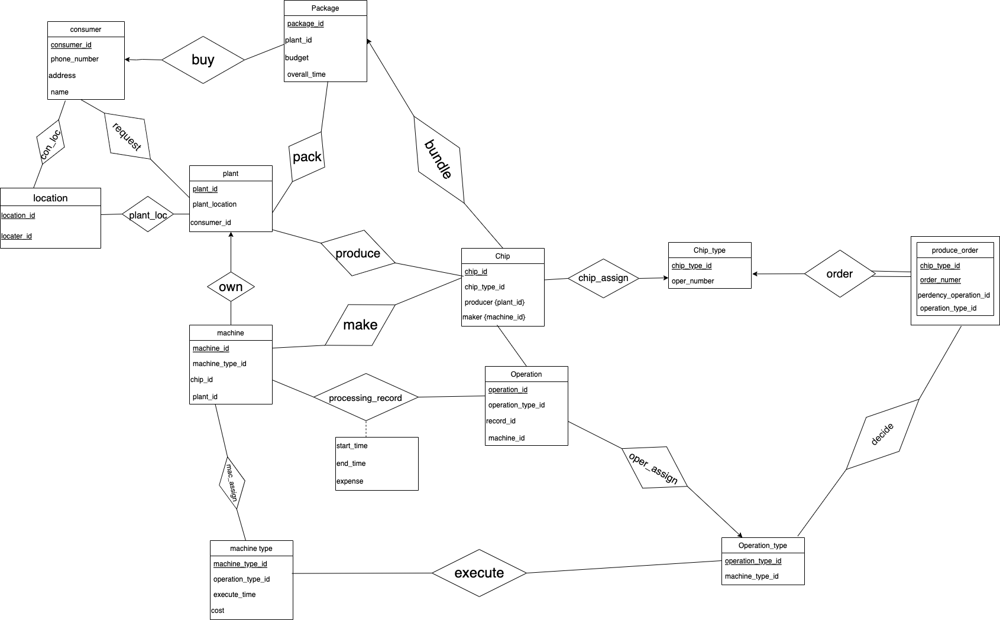

# CSC3170 Course Project

## Project Overall Description

This is our implementation for the course project of CSC3170, 2022 Fall, CUHK(SZ). For details of the project, you can refer to [project-description.md](project-description.md). In this project, we will utilize what we learned in the lectures and tutorials in the course, and implement either one of the following major jobs:

<!-- Please fill in "x" to replace the blank space between "[]" to tick the todo item; it's ticked on the first one by default. -->

- [x] **Application with Database System(s)**
- [ ] **Implementation of a Database System**

## Team Members

Our team consists of the following members, listed in the table below (the team leader is shown in the first row, and is marked with 🚩 behind his/her name):

<!-- change the info below to be the real case -->

| Student ID | Student Name   | GitHub Account (in Email)   | GiHub Username |
| ---------- | -------------- | --------------------------  | -------------- |
| 119010501  | Jose Andreas🚩 | 119010501@link.cuhk.edu.cn  |  119010501     |
| 120090895  | Xu Zijie       | kafka576890@gmail.com       |   Faria-34     |
| 119010459  | Zhao Qichen    | 119010459zqc@gmail.com      |  VictorZhao730 |
| 120090778  | Wang Yue       | 120090778@link.cuhk.edu.cn  |   120090778    |
| 119010381  | Yang Rui       | 1667724787@qq.com           |   RayandRain   |
| 120090842  | Chen Yanxi     | 120090842@link.cuhk.edu.cn  |   NoiseHacker  |

## Project Specification

<!-- You should remove the terms/sentence that is not necessary considering your option/branch/difficulty choice -->

After thorough discussion, our team made the choice and the specification information is listed below:

- Our option choice is: **Option 1**
- Our branch choice is: **Branch 1**
- The difficulty level is: **Normal**

## Project Abstract
Our group is going to choose these functionalities:
- Register the package information that is released by some consumer
- Allow the consumer to appoint some plant for some package manually

Our group gonna pick additional ones as follow:
- Geometrical Constraint
## Program Design
We break the project into three parts. First, we draw the ER diagram and the relation schema. Second, we construct the database according to the relation schema. Third, we construct the website.

The main component of the project is in the document flaskProject. The sql program firm.sql will construct the database and the python program app.py will construct the website. Besides, the sql program data_generation.sql can insert random data into the database.

### ER diagram
   
### Relation Schema
Consumer (<u>consumer_id</u>, supplier{plant_id}, phone_number, address, name)

Package (<u>package_id</u>, consumer_id, budget, overall_time)

Plant (<u>plant_id</u>, location_id)

Machine (<u>machine_id</u>, machine_type_id, plant_id)

Machine_type (<u>machine_type_id</u>, operation_type_id, excute_time, cost, feasibility)

Chip (<u>chip_id</u>, chip_type_id, producers{plant_id}, makers{machine_id}, package_id)

Chip_type (<u>chip_type_id</u>)

Operation (<u>operation_id, operation_type_id</u>)

Processing_record (<u>machine_id</u>, <u>operation_id</u>， start_time, end_time, expense)

Operation_type (<u>operation_type_id</u>)

Location (<u>location_id</u>, …….)

Produce_order (<u>order_number</u>, <u>perdency_operation_id</u>, <u>operation_type_id</u>)

## Historical Progress
## Functionality Implementation
### Database
### Website
#### Introduction:
This website is for consumers to buy chips. It can be composed to 2 parts. The first part asks for the consumer’s information. The other is information about chip. 
#### Procedure:
1. Consumers should assign their names, phone number and address firstly. Once they change their address, the program would produce names of companies which produce chips in the next part.
2. Consumer can choose companies’ names and number of chips in the second part of form.
3. After all, consumers click the submit button to input data in database.  
#### Function Implementation:
1. We use the function addeventlistener() to check if the address has changed. Once the address is changed, the program will ask for the value of new address and push names of nearby companies into value_list. Every value in the list will be imported to different options then append to each company select lists.
2. Code part: App.py: This code imports pymysql and flask to realize its function. It contains a function called index. This function is used to connect with index.html and chip.html. This function first connects the local database(firm), then uses post to get the data from index.html. This code is running on http://127.0.0.1:5000. To connect with this code, we use the form function and let its action equals http://127.0.0.1:5000 in the index.html file. Then, it uses pymysql to store data in the table. When the function finish, return chip.html.
## Contribution
1. ER Diagram and Relation Schema: Wang Yue and Xu Zijie
2. Database: Chen Yanxi and Jose Andreas
3. Generate Random data: Zhao Qichen
4. Website: Wang Yue and Xu Zijie
5. Report: Wang Yue and Xu Zijie(the website part), Yang Rui(other part and integration)
6. Presentation: Zhao Qichen, Chen Yanxi and Jose Andreas
